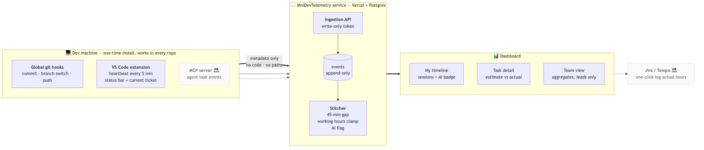

# DevPulse — dev telemetry

**Problem:** Measure actual coding sessions, manual *and* AI-assisted. Recording
this by hand is a pain in the ass, and Friday-afternoon timesheets are guesses.
So estimates vs actuals never get compared, and "is AI making us faster?" has no
answer.

**Answer:** A telemetry tool. And what better to measure than the footprint devs
already leave — **git**. Timestamped, automatic, nobody has to remember anything.

---

## How? Git hooks

3 ways to do it, each with caveats:

| | Verdict | Why |
|---|---|---|
| **1. GitHub Actions** | ❌ | Needs a workflow committed to the **client's repo** — nobody's approving that. Worse: CI only sees a *push*, so you lose all local timing (a 6pm push of 8 commits tells you nothing). |
| **2. Local repo hooks** | ❌ | Pain in the ass to set up per repo, on every machine, on every fresh clone. You'll sit at 60% coverage forever. |
| **3. Global hook** (`core.hooksPath`) | ✅ | One-time install, **works for every repo** — existing and future. Nothing written to any repo. Records **commit, branch switch, push**. |

Two more people suggest, both half-answers: `init.templateDir` (only catches
*future* clones) and server-side `pre-receive` hooks (needs admin on the client's
git server).

**Hooks never block git.** Fire-and-forget background worker, 2s timeout, offline
events spool and drain later. Measured: **~30ms commit with the API fully down.**
Also chains any pre-existing hooks path, so we don't break husky.

**Sent:** repo name, branch, ticket key, timestamp, diff stats.
**Never sent:** code, diffs, file paths, commit messages, prompts.

## Events → hours: the stitcher

- Groups by **ticket key from the branch** (`TEX-142-fix-upload` → `TEX-142`)
- Splits sessions on a **45-min gap**
- Clamps to **working hours** (09:00–18:00 Mon–Fri, your TZ)
- Flags **AI-assisted** (agent events or AI co-author trailer)
- Deterministic — safe to rebuild from scratch anytime

## Heartbeats — because git alone under-counts

Git knows when you *committed*, not when you *worked*. Start at 10:00, commit
once at 10:30 → session is 10:30–10:30 = **0 minutes recorded.**

The extension pings every **5 min while you're actually editing** (idle timeout:
5 min, so an editor left open overnight logs nothing). Now the session starts
when you started and ends when you stopped. Helps the dev who never touches AI —
exactly who git-only served worst.

## A dashboard

- **My timeline** — your sessions per day, ✦ AI badge, reported vs raw time
- **Task detail** — **estimate vs actual** + compression ratio (`0.6×` = 40% under)
- **Team view** — aggregates only, no per-person drill-down. The chart that
  matters: **AI-assisted vs non-AI**
- **Settings** — working hours, TZ, agent tokens (issue / revoke)

Google SSO. Agent tokens are **write-only** — a leaked token can't read anyone's
data. Individuals see their own data; leads see aggregates, enforced in queries.

## An extension

Because "run this terminal command with a URL flag" is a bad first impression.

- **One click "Enable DevPulse"** → device code → approve in browser → done
- **Status bar** shows your current ticket, live
- **Nudges you** when a branch has no ticket key (that time lands nowhere)
- Sends the heartbeats

Rollout = a `.vsix` file dropped in Slack. Install via *Extensions → Install from
VSIX*. Works in Cursor too. **No marketplace, no approval needed.**

## Where it's at

| | |
|---|---|
| Git hooks + one-command installer | ✅ |
| Ingestion API + session stitching | ✅ |
| Dashboard (timeline / task / team / settings) | ✅ |
| VS Code extension + heartbeats | ✅ `.vsix` ready to hand out |
| Jira estimates + Tempo logging | 🔜 |
| MCP server | 🔜 |

Deployed and usable now — it measures time, it just doesn't write back to Jira yet.

## Next

**Jira + Tempo** — pull the estimate straight off the ticket, then **one click to
log actual hours to Tempo**. Human approves first; no silent auto-logging. This
is what deletes timesheet work from your Friday.

**MCP server → 100% agentic coverage.** Today AI detection leans on commit
co-author trailers, which only works when the agent commits. Prompt Cursor all
afternoon and commit by hand → looks 100% human. An MCP server has the agent
report its own activity, so the session is flagged **regardless of who typed
`git commit`**.

Coverage today: **human dev ✅ · AI-assisted with human committing ~partial ·
fully agentic ❌**

---

## FAQ

**Is this surveillance?** It sees what your git log already contains, plus
"editor was active." No code, no keystrokes, no file names. Uninstall is one
command.

**Will it slow my commits?** No — ~30ms with the server offline. It can't block
or fail a commit.

**Offline?** Events spool locally, send on your next commit.

**Branch with no ticket key?** Time is still recorded (grouped by repo+branch)
but won't attach to a ticket. The extension nudges you.

**Ticket reopened, second branch?** Grouping is by *ticket key*, so
`TEX-142-feature` and `TEX-142-bugfix` both roll up to TEX-142.

**Anything committed to client repos?** No. Hooks live in your home dir, wired
through global git config.
