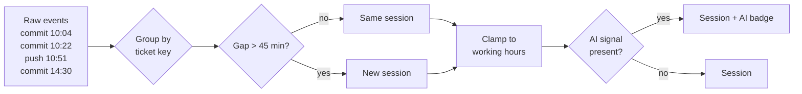
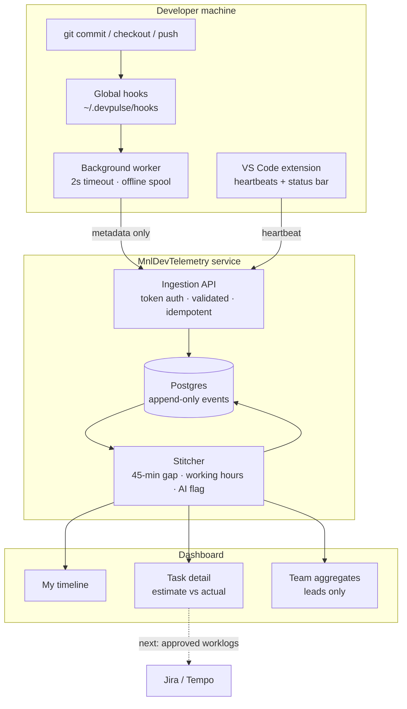

# MnlDevTelemetry — measuring where dev time actually goes

> Paste-ready for Confluence. The `mermaid` blocks need the Mermaid macro
> (Confluence Cloud: `/mermaid` → paste the block contents). If your space
> doesn't have it, screenshot the rendered diagrams or drop the blocks.

---

## The problem

We estimate tickets in hours. We log time against them. Nobody actually knows if
those two numbers have ever met.

Timesheets are filled in on Friday afternoon from memory. "That ticket took…
four hours? Five?" The number goes into Tempo and becomes truth forever. Then
someone asks whether AI tooling is making us faster, and the honest answer is a
shrug — we have no baseline, because the baseline was always guessed.

Manual time tracking doesn't fail because devs are lazy. It fails because it
asks someone deep in a debugging session to stop, context-switch, and do
bookkeeping. That's a tax nobody pays consistently.

So what do we actually want to know?

- How long did **this ticket** really take, start to finish?
- How does that compare to what we **estimated**?
- Was it **AI-assisted** or hand-written — and does that change the first two?
- Where's the gap between "hours in the day" and "hours that landed on tickets"?

## The idea

Stop asking devs to report. Devs already leave a detailed trail of everything
they do, timestamped to the second, in the one system they touch all day.

**Git.**

Every commit, branch switch, and push is a footprint with a timestamp on it.
Nobody has to remember anything — the log already happened. All that's missing is
something to read those footprints and turn them into hours.

That's MnlDevTelemetry: a telemetry layer that watches your **own machine's** git
activity, ships metadata (never code) to a small service, and stitches it into
"you spent 3h 20m on TEX-142, and Claude was involved."

---

## How do we collect it?

Git can run scripts on lifecycle events — hooks. The question is *where the
hooks live*, and this is where most attempts die. Three realistic options:

| Approach | Verdict | Why |
|---|---|---|
| **1. GitHub Actions / CI** | ❌ | Needs a workflow file **committed to the client's repo**. No client is approving a "telemetry" PR against their codebase, and rightly so. Worse: CI only sees a **push**. A 6pm push of 8 commits tells you nothing about when the work happened — you lose every bit of local timing, which is the entire point. Also assumes everything's on GitHub; plenty isn't. |
| **2. Per-repo hooks** (`.git/hooks/`) | ❌ | Technically invisible to the client (`.git/hooks` isn't tracked), so the privacy story is fine. The adoption story isn't: someone has to install hooks in *every repo, on every machine*, and redo it on every fresh clone. You'll have 60% coverage forever and never know which 40% is missing. |
| **3. Global hooks** (`core.hooksPath`) | ✅ | One command, once, per machine. Git then uses your hooks for **every repo you touch** — existing, new, cloned tomorrow. Nothing is written to any repo. Nothing is committed anywhere. |

Option 3 wins, and it isn't close. `git config --global core.hooksPath ~/.devpulse/hooks`
is the whole trick. You instrument **the developer**, not the codebase.

### Two footnotes on the above

You were basically right, but for completeness there are two more options people
suggest, and both are half-answers:

- **`init.templateDir`** — git copies a template hooks dir into repos when they're
  cloned or `init`ed. Real mechanism, but it only catches **future** repos and
  silently skips everything already on your disk. Global `hooksPath` covers both.
- **Server-side hooks** (`pre-receive`) — would need admin on the client's git
  server. Non-starter, for the same reason as option 1.

(Polling the GitHub API for commit history is also technically possible and also
a non-starter for client orgs — no access, and again push-time only.)

### What the hooks capture

Three hooks, installed once:

| Hook | Event | What it means |
|---|---|---|
| `post-commit` | `commit` | You committed — with diff stats |
| `post-checkout` | `branch_switch` | You moved to another branch (often = started a different ticket) |
| `pre-push` | `push` | You pushed |

### The non-negotiable: hooks must never break git

A telemetry tool that makes `git commit` hang is a tool that gets uninstalled by
lunchtime. So the hook is deliberately dumb — it launches a background worker,
fully detached, and exits immediately:

```sh
node "$DEVPULSE_HOME/agent.js" "post-commit" "$@" </dev/null >/dev/null 2>&1 &
exit 0
```

Everything after that is the worker's problem, not git's:

- Network call capped at **2 seconds**
- Offline? The event **spools to a local file** and drains on your next commit
- Worker crashes? It still exits 0
- Measured: committing with the API completely down returns in **~30ms**

It also **chains** any pre-existing global `hooksPath`, so if you already had
hooks there, they still run and their exit code still counts. We don't silently
swallow somebody's pre-commit gate.

**Known caveat:** if a repo sets `core.hooksPath` *locally* (husky does this),
the local setting wins and our hooks don't fire in that repo. We don't break
husky, but we also don't see that repo. Fine for now; worth solving later.

### What actually leaves your machine

This is the part to read closely, because "telemetry" understandably makes
people nervous.

**Sent:** repo name (basename only — `web-app`, not a path), branch name, ticket
key, timestamp, and diff stats (files changed, insertions, deletions), commit
SHA.

**Never sent:** code. Diffs. File names or paths. Commit message bodies. Prompts.
Keystrokes. Screenshots.

Two things enforce it rather than just promising it. The event schemas strip
unknown fields, so a field nobody meant to add gets dropped before it's stored,
not after. And commit messages are read *only* to check for an AI co-author
trailer — the message itself is never transmitted.

And on who sees what: **individuals see their own data. Leads see aggregates
only** — no per-person drill-down. That's enforced in the database queries, not
just hidden in the UI.

---

## From footprints to hours: the stitcher

Raw events are useless on their own. Dozens of disconnected timestamps.
"Commit at 10:04. Commit at 10:22. Push at 10:51." So what?

The stitcher turns that pile into **work sessions**:

1. **Group** events by ticket key — pulled from the branch name via
   `\b[A-Z][A-Z0-9_]+-\d+\b`, so `TEX-142-fix-upload` → `TEX-142`. No ticket key
   in the branch? Falls back to grouping by repo + branch.
2. **Split on a 45-minute gap.** Events closer together than that are one
   continuous session. A longer gap means you went to lunch, so a new session
   starts.
3. **Clamp to working hours.** Only time inside your configured hours
   (default 09:00–18:00 Mon–Fri, your timezone) counts as *reported* time. The
   raw span is kept too, so a 2am debugging spiral isn't erased — it just doesn't
   inflate the number that would go to Jira.
4. **Flag AI involvement** if the session contains agent activity or a commit
   with an AI co-author trailer, and record which tool.



Two properties that matter more than they sound:

- **Events are append-only.** Corrections happen in the stitcher, never by
  editing history.
- **Re-running is deterministic.** The same events always produce the same
  sessions, so it's safe to rebuild everything from scratch at any time. Change
  your working hours and re-run — the past recalculates correctly.

### Then there's the hole in git-only tracking

Git tells you *when you committed*, not *when you worked*. That gap is bigger
than it first looks:

- You start at 10:00, work solidly, commit once at 10:30. First event of the day
  **is** that commit. Session = 10:30 to 10:30. **Zero minutes recorded** for 30
  minutes of real work.
- You commit at 10:30 and keep going until noon. Session ends at the last event.
  **90 more minutes gone.**

Careful devs who commit less often get penalised the hardest, which is exactly
backwards.

---

## Heartbeats: closing both ends

The fix is a presence ping from the editor. While you're **actively editing**,
the extension sends a tiny heartbeat every **5 minutes**: *"still working, repo
X, branch Y, at T."* Repo and branch only — same metadata rules as everything
else.

Now the session starts when you *started*, and ends when you *stopped*:

```mermaid
gantt
  title Same morning, two ways of measuring
  dateFormat HH:mm
  axisFormat %H.%M
  section Git only
  real work, invisible   :done, a1, 10:00, 30m
  commit, then recorded 0 min :crit, a2, 10:30, 2m
  section With heartbeats
  pings while editing    :active, b1, 10:00, 30m
  commit                 :milestone, b2, 10:30, 0m
  recorded 30 min        :b3, 10:00, 30m
```



Two design details that keep it honest:

- **Idle detection is mandatory.** Pings are gated on real edit activity, and
  stop **5 minutes** after you go quiet. Without that, leaving VS Code open
  overnight would log 8 hours of "work" and poison the exact metric this exists
  to fix.
- **5 minutes is well under the 45-minute session gap**, so a stream of pings
  never accidentally splits a session. There's a runtime assertion enforcing that
  relationship so nobody can misconfigure it into nonsense.

Worth saying plainly: heartbeats are **agent-agnostic**. They help the dev who's
never opened an AI tool, which is the person git-only tracking served worst.

**Honest limits.** It measures *editor presence*. It can't see you debugging in a
browser, in a meeting about the ticket, or reasoning at a whiteboard. It's a good
proxy, not truth. And it covers VS Code / Cursor — vim and JetBrains users get
git-only accuracy for now.

---

## The dashboard

Where the data becomes answers. Four screens.

**My timeline** — your week, grouped by day. Each session shows the ticket, the
time window, an ✦ AI badge when an agent was involved, and reported vs raw time.
Top-line stats: hours reported, AI-assisted share, tickets touched.

**Task detail** — the money screen. **Estimate vs actual** for one ticket, plus a
compression ratio (actual ÷ estimate: `0.6×` means you came in 40% under). Every
session that fed the total is listed underneath. Estimates are entered manually
today; pulling them from Jira is next.

**Team** (leads only) — aggregates. Estimate-compression trend over time, and the
one chart that answers the original question: **AI-assisted vs non-AI tickets**,
side by side. Deliberately **no per-individual drill-down** — this is for
spotting patterns, not for performance-managing people.

**Settings** — working hours and timezone (these drive the clamp), plus agent
tokens: issue, see last-used, revoke.

Auth is Google SSO (there's also a password-less dev login behind an env flag,
for local work and demos where waiting on SSO approval would block things).
Agent tokens are **write-only** — a leaked token can submit events, never read
anyone's data — stored as hashes, and revocable from Settings.

---

## The extension: making rollout not suck

All of the above still needed a teammate to run a terminal command with a URL
flag, then paste a code into a browser. Works, but it's a bad first impression
and it doesn't scale past the people who'll tolerate it.

So: a VS Code extension. It doesn't reinvent anything — same installer
underneath, same hooks, same tokens. It just puts a button on it.

- **One-click setup.** "Enable MnlDevTelemetry" → it runs the install, shows your
  device code, opens the activation page. Sign in, approve, done.
- **Status bar.** Your current ticket, live, read from the branch you're on.
- **Branch-name nudge.** On a branch with no ticket key, the status bar quietly
  warns you — because a branch named `fix-stuff` means that time lands nowhere.
  Cheapest possible fix for the most common data-quality problem.
- **Commands:** enable, status, open dashboard, open current task, uninstall.
- **Heartbeats** — the extension is what sends them.

Rollout is a `.vsix` file: drop it in Slack, teammates install via *Extensions →
Install from VSIX*, works in Cursor too. **No marketplace, no approval process,
nothing public.** Publishing to the VS Code Marketplace / Open VSX is a later
convenience, not a prerequisite — and when we do, it's an automated scan, not a
human review gate.

Uninstall is one command and restores your previous git config. Nobody's trapped.

---

## How it fits together



The whole service is one deployable unit — a Next.js app (UI *and* API routes)
plus Postgres. Currently running on Vercel with a hosted Postgres. No separate
services, no queue, no infrastructure to babysit.

---

## Where this is at

| Piece | State |
|---|---|
| Ingestion API + data model | ✅ Working |
| Git hooks + one-command installer | ✅ Working |
| Session stitching (gap, clamp, AI flag) | ✅ Working, unit-tested |
| Dashboard (timeline / task / team / settings) | ✅ Working |
| VS Code extension + heartbeats | ✅ Working, `.vsix` ready to hand out |
| Jira estimates + worklog push to Tempo | 🔜 Next |
| MCP server for agentic coding | 🔜 Planned |

Deployed and usable today. Time is measured and visible; it just doesn't write
back to Jira yet.

## What's next

**1. Close the loop to Jira/Tempo.** Right now MnlDevTelemetry *measures* hours; it
doesn't log them. Next up: nightly drafts of "here's your time per ticket per
day," a screen to edit and approve them, and one click to push approved worklogs
to Tempo. Human approval stays in the loop — no silent auto-logging, ever. That's
the difference between an interesting dashboard and something that deletes
timesheet work from your Friday.

**2. An MCP server — full coverage for agentic coding.** Today's blind spot: AI
attribution leans on commit co-author trailers. That works when the agent commits
for you. It does **not** work for the increasingly common pattern where you prompt
Cursor or Claude Code all afternoon and then commit by hand — no trailer, no
signal, and the session looks 100% human.

An MCP server fixes this at the source. The agent itself reports task boundaries
and tool calls, so any session containing agent activity is flagged **regardless
of who typed `git commit`**. Trailers give per-commit attribution; agent events
give per-session attribution — and the second is what actually matches how people
work.

That's also what makes fully agentic work measurable at all. When an agent is
running the task, the human's git footprint gets sparse and the current model
under-counts badly. Heartbeats close the gap for human work; MCP closes it for
agent work.

The honest summary of coverage today: **human development, well covered. AI-
assisted with a human committing, partially covered. Fully agentic, not yet.**

---

## FAQ

**Is this surveillance?**
It records the same events your git log already contains, plus "editor was
active." No code, no keystrokes, no screenshots, no file names. Individuals see
their own data; leads see aggregates with no per-person drill-down, enforced in
the queries. And you can uninstall it in one command.

**Will it slow down my commits?**
No. The hook backgrounds its work and exits — measured at ~30ms with the server
completely offline. It cannot block or fail a commit.

**What if I'm offline?**
Events spool locally and send on your next commit. Nothing is lost.

**What if my branch has no ticket key?**
The time is still recorded, grouped by repo + branch, but it won't attach to a
ticket. Name branches `TEX-142-whatever` and it lands correctly — the extension
nudges you when you forget.

**A ticket got reopened and I made a second branch. Does that work?**
Yes. Grouping is by *ticket key*, not branch. `TEX-142-feature` and
`TEX-142-bugfix` both roll up to TEX-142, with the new sessions on their own
dates. Total ticket cost stays honest across its whole life.

**Does anything get committed to client repos?**
No. Hooks live in your home directory and are wired up through global git config.
Nothing is written to, or committed into, any repo.
